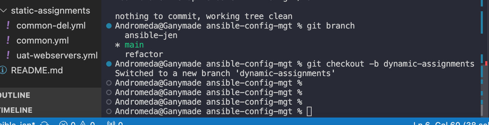
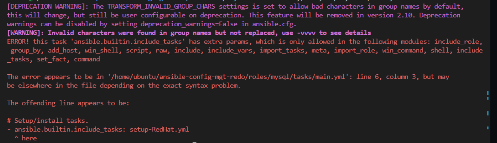

# Ansible Dynamic Assignments (Include) and Community Roles


My [previous projects](https://github.com/AndromedaIsComingg/DevOps-Projects-Darey.io/blob/main/Project%2012-Ansible-Refactoring-Assignments-%26-Imports/README.md) have already done justice to some knowledge and skills on Ansible, now we can perform configurations using `playbooks`, `roles` and `imports`. Now we will continue configuring our UAT servers learning and practicing new Ansible concepts and modules.
 
In this project we will introduce `dynamic assignments` by using include module.

##### The difference?
The difference between `static` and `dynamic` assignments is that static assignments use `import` Ansible module. The module that enables dynamic assignments is `include`. 

Hence,

```
import = Static

include = Dynamic
```

When the `import` module is used, all statements are pre-processed at the time playbooks are `parsed`. Meaning, when you execute `site.yml` playbook, Ansible will process all the playbooks referenced during the time it is parsing the statements. This also means that, during actual execution, if any statement changes, such statements will not be considered. Hence, it is static.
On the other hand, when include module is used, all statements are processed only during execution of the playbook. Meaning, after the statements are `parsed`, any changes to the statements encountered during execution will be used.
Take note that in most cases it is recommended to use static assignments for playbooks, because it is more reliable. With dynamic ones, it is hard to debug playbook problems due to its dynamic nature. However, you can use dynamic assignments for environment specific variables as we will be introducing in this project.

## Introducing Dynamic Assignment Into Our Existing structure

Hint: To preserve your your GitHub in actual state after you install a new role - make a commit and push to master your 'ansible-config-mgt' directory. Of course you must have git installed and configured on `Jenkins-Ansible` server and, for more convenient work with codes, you can configure Visual Studio Code to work with this directory. In this case, you will no longer need webhook and Jenkins jobs to update your codes on `Jenkins-Ansible` server, so you can disable it - we will be using Jenkins later for a better purpose.


##### Creating a new branch `dynamic-assignments`



Create a new folder, name it `dynamic-assignments`. Then inside this folder, create a new file and name it `env-vars.yml`. We will instruct site.yml to `include` this playbook later. For now, let us keep building up the structure.


**Note:**  Depending on what method you used in the previous project you may have or not have `roles` folder in your GitHub repository - if you used `ansible-galaxy`, then roles directory was only created on your `Jenkins-Ansible` server locally. It is recommended to have all the codes managed and tracked in GitHub, so you might want to recreate this structure manually in this case we will still be using VS Code. 

Now our new folder structure should look like this

```
├── dynamic-assignments
│   └── env-vars.yml
├── inventory
│   └── dev
    └── stage
    └── uat
    └── prod
└── playbooks
    └── site.yml
└── roles (optional folder)
    └──...(optional subfolders & files)
└── static-assignments
    └── common.yml

```

Since we will be using the same Ansible to configure multiple environments, and each of these environments will have certain unique attributes, such as servername, ip-address etc., we will need a way to set values to variables per specific environment.
For this reason, we will now create a folder to keep each environment's variables file. Therefore, create a new folder env-vars, then for each environment, create new YAML files which we will use to set variables.
Your layout should now look like this.

```
├── dynamic-assignments
│   └── env-vars.yml
├── env-vars
    └── dev.yml
    └── stage.yml
    └── uat.yml
    └── prod.yml
├── inventory
    └── dev
    └── stage
    └── uat
    └── prod
├── playbooks
    └── site.yml
└── static-assignments
    └── common.yml
    └── webservers.yml

```


Now paste the instruction below into the `env-vars.yml` file.

```yaml
---
- name: collate variables from env specific file, if it exists
  hosts: all
  tasks:
    - name: looping through list of available files
      include_vars: "{{ item }}"
      with_first_found:
        - files:
            - dev.yml
            - stage.yml
            - prod.yml
            - uat.yml
          paths:
            - "{{ playbook_dir }}/../env-vars"
      tags:
        - always

```

**Notice 3 things to notice here:**

We used `include_vars` syntax instead of `include`, this is because Ansible developers decided to separate different features of the module. From Ansible version 2.8, the `include` module is deprecated and variants of `include_*` must be used. These are:


- include_role
- include_tasks
- include_vars

In the same version, variants of import were also introduces, such as:

- import_role
- import_tasks


We made use of a special variables `{{ playbook_dir }}` and `{{ inventory_file }}`. `{{ playbook_dir }}` will help Ansible to determine the location of the running playbook, and from there navigate to other path on the filesystem. `{{ inventory_file }}` on the other hand will dynamically resolve to the name of the inventory file being used, then append `.yml` so that it picks up the required file within the env-vars folder.
We are including the variables using a loop. `with_first_found` implies that, looping through the list of files, the first one found is used. This is good so that we can always set default values in case an environment specific env file does not exist.

## Update site.yml with Dynamic Assignments

Update `site.yml` file to make use of the dynamic assignment

it should contain the following

```yaml
---
- hosts: all
- name: Include dynamic variables 
  tasks:
  import_playbook: ../static-assignments/common.yml 
  include: ../dynamic-assignments/env-vars.yml
  tags:
    - always

-  hosts: webservers
- name: Webserver assignment
  import_playbook: ../static-assignments/webservers.yml


```

## Community Roles

Now it is time to create a role for MySQL database - it should install the MySQL package, create a database and configure users. But why should we re-invent the wheel? There are tons of roles that have already been developed by other open source engineers out there. These roles are actually production ready, and dynamic to accomodate most of Linux flavours. With Ansible Galaxy again, we can simply download a ready to use ansible role, and keep going.

## Download Mysql Ansible Role

You can browse available community roles [here](https://galaxy.ansible.com/home)

We will be using a [MySQL role developed by geerlingguy](https://galaxy.ansible.com/geerlingguy/mysql).


On `Jenkins-Ansible` server make sure that `git` is installed with `git --version`, then go to 'ansible-config-mgt' directory and run


```git init
git pull https://github.com/<your-name>/ansible-config-mgt.git
git remote add origin https://github.com/<your-name>/ansible-config-mgt.git
git branch roles-feature
git switch roles-feature
```

Inside `roles` directory create your new MySQL role with `ansible-galaxy install geerlingguy.mysql` and rename the folder to `mysql` using :

`sudo ansible-galaxy install geerlingguy.mysql`

`mv geerlingguy.mysql/ mysql`

Note that:

 `Ansible` role default path configuration is in the file `/etc/ansible/ansible.cfg`

The path of this file can be confirmed using the command

`ansible-config dump | grep DEFAULT_ROLES_PATH`

To confirm the installation of roles we can use the command

`ansible-galaxy list`


Read `README.md` file, and edit roles configuration to use correct credentials for MySQL required for the `tooling` website.


From roles, update the defaults/main.yml file with the following using 

`vi roles/mysql/defaults/main.yml`

```yaml
# Databases.
mysql_databases:
   - name: tooling
     collation: utf8_general_ci
     encoding: utf8
     replicate: 1


# Users.
mysql_users: 
   - name: webaccess
     host: 0.0.0.0
     password: secret
     priv: '*.*:ALL,GRANT'
```


Update `static-assignments` with

`db.yml` file (create a new file)

```yaml
---
- hosts: db
  become: yes
  roles:
     - mysql

```


Now create a Pull Request and merge changes to main branch on GitHub with the following commands

```
git add .
git commit -m "Commit new role files into GitHub"
git push --set-upstream origin roles-feature

```


## Load Balancer roles


We want to be able to choose which Load Balancer to use, `Nginx` or `Apache`, so we need to have two roles respectively:

1. Nginx
2. Apache

With our experience on Ansible so far you can:

- Decide if you want to develop your own roles, or find available ones from the community
- Update both static-assignment and site.yml files to refer the roles


##### Creating Nginx and Apache roles

On Jenkins-Ansible server go to ‘ansible-config-mgt’ directory.

Inside roles directory create your new Nginx and Apache role with this command


```
ansible-galaxy install geerlingguy.nginx
ansible-galaxy install geerlingguy.apache
```


Then rename the folders to nginx and apache respectively with the commands:


```
mv geerlingguy.nginx/ nginx
mv geerlingguy.apache/ apache
```


##### Configuring Apache & Nginx role

Read the README.md file, and edit the roles configuration to use correct credentials for `Nginx` & `Apache` as follows:

##### NGINX
From `nginx` folder in roles:

- update the defaults/main.yml file with this below

```yaml
nginx_upstreams: 
 - name: myapp1
   strategy: "ip_hash" # "least_conn", etc.
   keepalive: 16 # optional
   servers: {
       "web1 weight=3",
       "web2 weight=3"
     }

nginx_log_format: |
  '$remote_addr - $remote_user [$time_local] "$request" '
  '$status $body_bytes_sent "$http_referer" '
  '"$http_user_agent" "$http_x_forwarded_for"'

enable_nginx_lb: false
load_balancer_is_required: false
```


- Update handlers/main.yml with this

```yaml
---
- name: restart nginx
  become: yes
  service: name=nginx state=restarted

- name: validate nginx configuration
  become: yes
  command: nginx -t -c /etc/nginx/nginx.conf
  changed_when: false

- name: reload nginx
  become: yes
  service: name=nginx state=reloaded
  ```


- Update tasks/main.yml with this

```yaml
# Vhost configuration.
- import_tasks: vhosts.yml

- name: set webservers host name in /etc/hosts
  become: yes
  blockinfile:
    path: /etc/hosts
    block: "{{ item.ip }} {{ item.name }}"
  loop:
    - { name: "web1", ip: "172.31.20.10" }
    - { name: "web2", ip: "172.31.19.72" }
    
    
# Nginx setup.
- name: Copy nginx configuration in place.
  become: true
  template:
    src: "{{ nginx_conf_template }}"  
    dest: "{{ nginx_conf_file_path }}"
    owner: root
    group: "{{ root_group }}"
    mode: 0644
  notify:
    - reload nginx

- name: Ensure nginx service is running as configured.
  become: true
  service:
    name: nginx
    state: "{{ nginx_service_state }}"
    enabled: "{{ nginx_service_enabled }}"

```


##### APACHE
From `apache` folder in roles, update the defaults/main.yml file with this below

```yaml
# Apache package state; use `present` to make sure it's installed, or `latest`
# if you want to upgrade or switch versions using a new repo.
apache_packages_state: present

enable_apache_lb: false
load_balancer_is_required: false

#webservers
loadbalancer_name: "myapp1"
web1: "private-ip weight=3"
web2: "private-ip weight=3"

```


Important Hints:


- Since we cannot use both `Nginx` and `Apache` load balancer, you need to add a condition to enable either one - this is where you can make use of variables.


- Declare a variable in `defaults/main.yml` file inside the Nginx and Apache roles. Name each variables `enable_nginx_lb` and `enable_apache_lb` respectively.


- Set both values to false like this `enable_nginx_lb: false` and `enable_apache_lb: false`.


- Declare another variable in both roles `load_balancer_is_required` and set its value to `false` as well


- Update `static-assignments` folder with the file (create a new file) `loadbalancers.yml` and update content of `site.yml` (in the playbook folder) file as shown below


```yaml
- hosts: lb
  roles:
    - { role: nginx, when: enable_nginx_lb and load_balancer_is_required }
    - { role: apache, when: enable_apache_lb and load_balancer_is_required }

```


`Update site.yml` file with


```
---
- name: importing common file
  become: true
  import_playbook: ../static-assignments/common.yml
  tags:
    - always

- name: uat-webserver assignment
  import_playbook: ../static-assignments/uat-webservers.yml

- name: include env-vars file
  import_playbook: ../dynamic-assignments/env-vars.yml
  tags:
     - always

- name: import db files
  import_playbook: ../static-assignments/db.yml

- name: Loadbalancers assignment
  import_playbook: ../static-assignments/loadbalancers.yml
  when: load_balancer_is_required 
   

```


Now you can make use of `env-vars\uat.yml` file to define which loadbalancer to use in UAT environment by setting respective environmental variable to `true`.

You will activate load balancer, and enable `nginx` by setting these in the respective environment's env-vars file.

So paste the code below in the `env-vars\uat.yml`

```
enable_nginx_lb: true
load_balancer_is_required: true
```


The same must work with `apache` LB, so you can switch it by setting respective environmental variable to `true` and other to `false`.


To test this, you can update inventory for each environment and run Ansible against each environment.


```

ansible-playbook -i inventory/uat.yml playbooks/site.yml

```

### BLOCKER CAUTION!!!

Please note that if your play throws an error about the `ansible.builtin.include_tasks` module as shown below



you will have to edit the file `roles/mysql/tasks/main.yml`, such that you will delete the texts "ansible.builtin." everywhere it appears in the file.

When this is done, we should have a successful play as shown below


##### Congratulations!

We have learned and implemented how to use Ansible configuration management tool to prepare UAT environment for Tooling web solution executind dynamic assignments using the `include` module.


 ------------------------------------------------------------------------------
